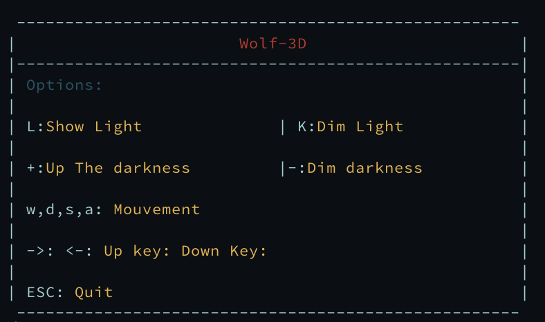
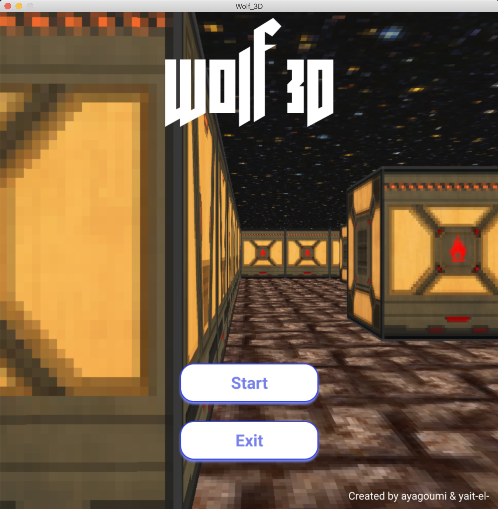
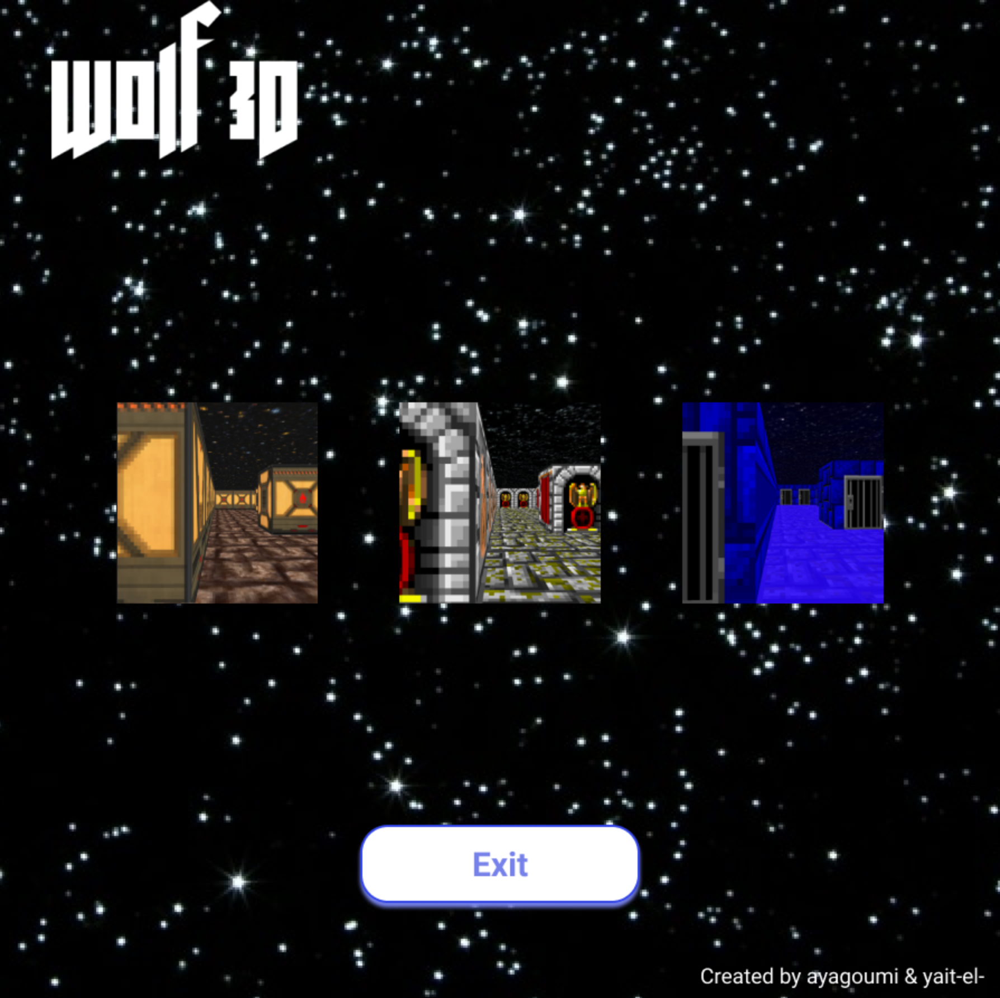
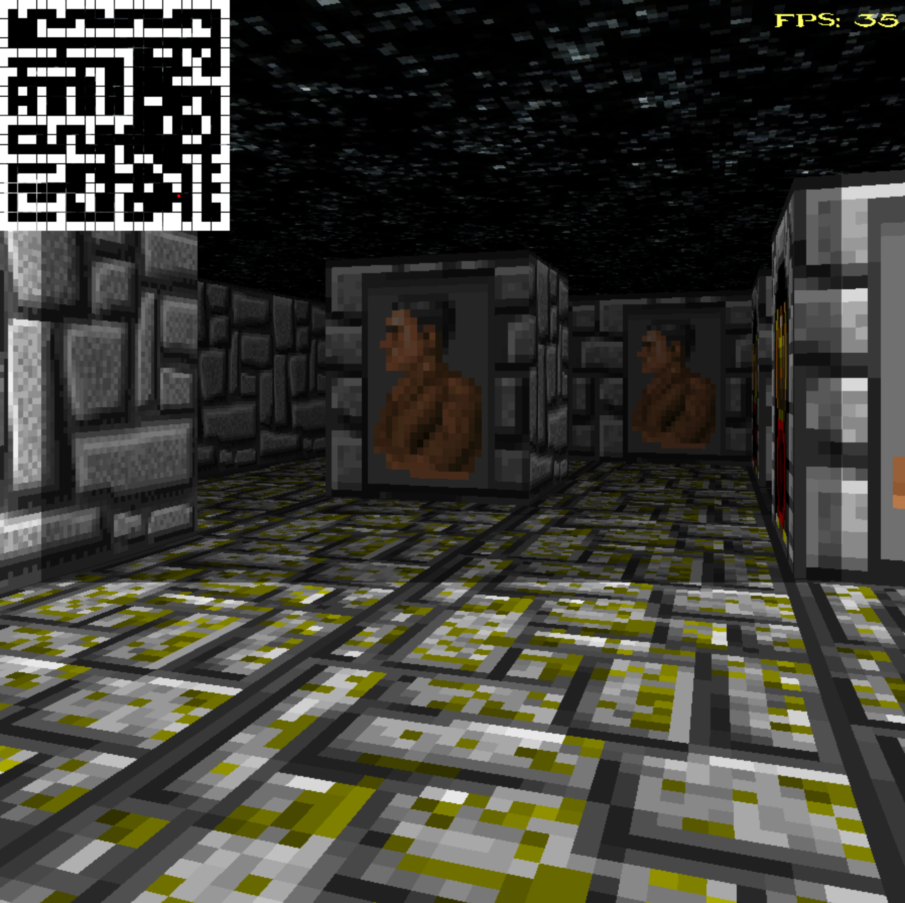
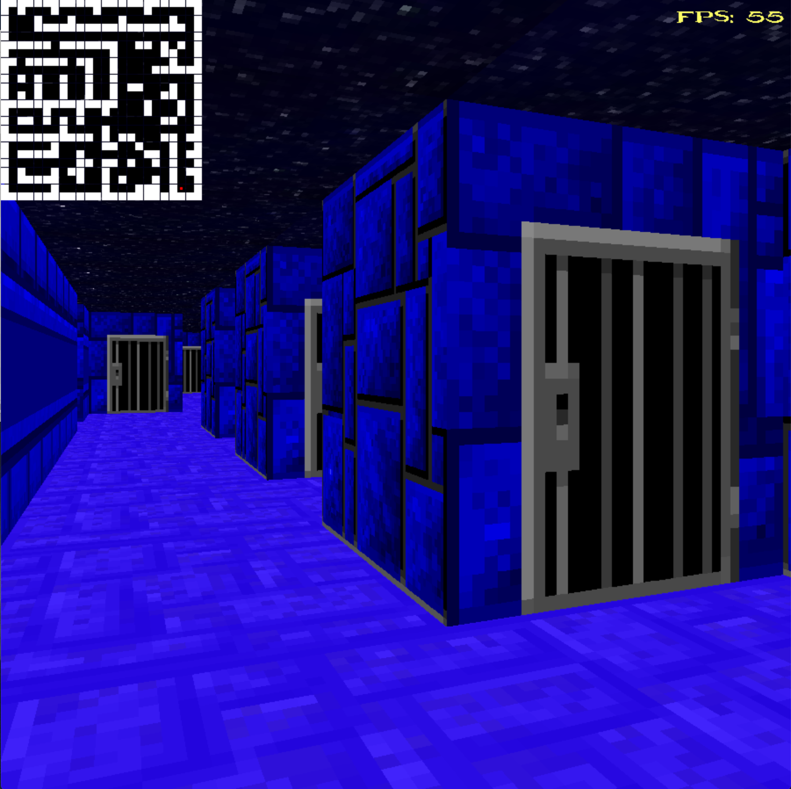

# Wolf3D

This project is my first step in the game dev universe !
Entirely made in C with SDL2 using my own standard C library.
The game is limited to 60 FPS.


## Preview

## Usage

## Installation:

#### *SDL2*

__*Ubuntu:*__

```bash
sudo apt-get install libsdl2-dev libsdl2-mixer-dev libsdl2-ttf-dev
```

__*Fedora:*__

```bash
sudo dnf install SDL2-devel SDL2_mixer-devel SDL2_ttf-devel
```

__*MacOS:*__

All ready for use. Just type **make**.

## Compiling

Use [make](https://en.wikipedia.org/wiki/Makefile) for compiling all files.

When you have already installed SDL2 library you can use this simple rules:
- **make**: Compile all.
- **make clean**: Delete temporary files.
- **make del**: Delete temporary Wolf3D files only(if you changed code use `make del && make` for re-compile only Wolf3D executable without libft).
- **make fclean**: Delete executable Wolf3D file & libft.
- **make re**: It's rules - **make fclean** & **make** in one.
## Keyboard shortcuts

<table width="100%">
<thead>
<tr>
<td width="65%" height="60px" align="center" cellpadding="0">
<strong>Description</strong>
</td>
<td width="10%" align="center" cellpadding="0">
<span style="width:70px">&nbsp;</span><strong>Key(s)</strong><span style="width:50px">&nbsp;</span>
</td>
</tr>
</thead>
<tbody>
<tr>
<td valign="top" height="30px">Close the program (aka quit/exit)</td>
<td valign="top" align="center"><kbd>&nbsp;esc&nbsp;</kbd></td>
</tr>
<tr>
<td valign="top" height="30px">Move Up</td>
<td valign="top" align="center"><kbd>&nbsp;W or ▲&nbsp;</kbd></td>
</tr>
<tr>
<td valign="top" height="30px">Move Down</td>
<td valign="top" align="center"><kbd>&nbsp;S or ▼&nbsp;</kbd></td>
</tr>
<tr>
<td valign="top" height="30px">Move left</td>
<td valign="top" align="center"><kbd>&nbsp;A or ◄&nbsp;</kbd></td>
</tr>
<tr>
<td valign="top" height="30px">Move right</td>
<td valign="top" align="center"><kbd>&nbsp;D or ►&nbsp;</kbd></td>
</tr>
<tr>
<td valign="top" height="30px">Show Light</td>
<td valign="top" align="center"><kbd>&nbsp;L&nbsp;</kbd></td>
</tr>
<tr>
<td valign="top" height="30px">Dim Light</td>
<td valign="top" align="center"><kbd>&nbsp;K&nbsp;</kbd></td>
</tr>
<tr>
<td valign="top" height="30px">Up The darkness</td>
<td valign="top" align="center"><kbd>&nbsp;+&nbsp;</kbd></td>
</tr>
<tr>
<td valign="top" height="30px">Dim darkness</td>
<td valign="top" align="center"><kbd>&nbsp;-&nbsp;</kbd></td>
</tr>

</tbody>
</table>

## Mouse controls

<table width="100%">
<thead>
<tr>
<td width="60%" height="60px" align="center" cellpadding="0">
<strong>Description</strong>
</td>
<td width="10%" align="center" cellpadding="0">
<span style="width:70px">&nbsp;</span><strong>Control(s)</strong><span style="width:50px">&nbsp;</span>
</td>
</tr>
</thead>
<tbody>
<tr>
<td valign="top" height="30px">Fire</td>
<td valign="top" align="center"><kbd>&nbsp;left button&nbsp;</kbd></td>
</tr>
</tbody>
</table>
## Screenshots

**Usage message and controls:**



**Program running:**








